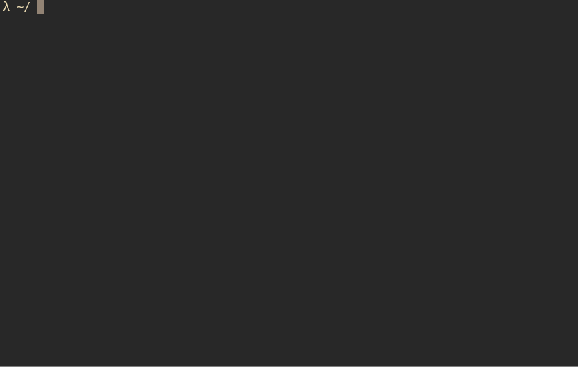

[](https://github.com/Kaderovski)
[](https://choosealicense.com/licenses/mit/)
<p align="center">
    
</p>
<h1 align="center">Zellij Sessions</h1>
<p align="center"><i>Manage your Zellij sessions on starting your favorite shell</i></p>

# Dependencies

You need <a href="https://github.com/lotabout/skim" target="_blank">sk</a> binary installed and in your `$PATH` and of course <a href="https://github.com/zellij-org/zellij/" target="_blank">zellij</a>.

# Installation

You can use this command <i>(tested on BASH and ZSH)</i>:

```shell
ZJ_SESSIONS=$(zellij list-sessions)
NO_SESSIONS=$(echo "${ZJ_SESSIONS}" | wc -l)

if [ "{$ZELLIJ}" ] && [ -z "${ZELLIJ_SESSION_NAME}" ]; then
  read REPLY\?"New zellij session [y/n] ? "
  if [ "${REPLY}" = "y" ]; then
    read SESS\?"Session name : "
    zellij --layout compact attach -c "${SESS}"
  else
    if [ "${NO_SESSIONS}" -ge 1 ]; then
      zellij --layout compact attach \
      "$(echo "${ZJ_SESSIONS}" | sk)"
    else
    fi
  fi
fi
```

# Contributors

<a href="https://github.com/kaderovski/shloader/graphs/contributors">
  
</a>

# License

 - Zellij Sessions is under the MIT LICENSE
 - See [LICENSE](LICENSE)
